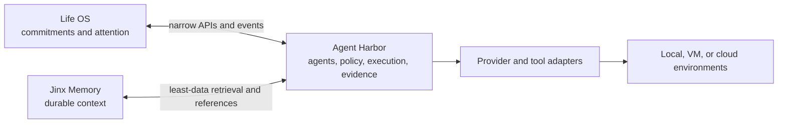

> Public-source preparation: the owner has approved preparing Agent Harbor for a public repository. Personal data and integrations remain private. Earlier private-product language below records the original design direction; release gates are in [docs/release-readiness.md](docs/release-readiness.md).

# Agent Harbor architecture

Status: current architecture map and target boundaries as of August 30, 2026.

This document separates what exists from what the roadmap proposes. The current
handoff in `docs/plans/current-handoff.md` remains the source for exact branch,
runtime, and live-acceptance status.

## System boundary

Agent Harbor owns agent execution and the controls around it. Life OS owns
attention and commitments. Jinx Memory owns durable knowledge and retrieval.

The three applications have independent storage and must tolerate either
integration being absent. Retrieved memory and external content are evidence,
not execution authority.

## Current implementation

The current application is an Electron desktop shell around a React interface
and a local harness server:

| Layer | Current location | Responsibility |
|---|---|---|
| Desktop shell | `electron/` | Starts the embedded services and exposes platform capabilities such as speech, screen capture, and local computer control. |
| Interface | `src/` | Chat, agent settings, model selection, rooms, approvals, connected apps, and computer controls. |
| Local API | `server/index.ts` | Typed commands for bots, turns, approvals, models, computers, connectors, and configuration over HTTP plus one SSE event stream. |
| Harness | `server/harness/` | Provider registry, live instances, turn routing, and the fan-in event bus. |
| Provider adapters | `server/drivers/` | Normalize local CLI, ACP, OpenRouter, and computer-provider behavior behind shared contracts. |
| Persistent compatibility state | `~/.openmausbot/` | Current local bot, transcript, event, configuration, and fallback-secret paths. Renaming requires a tested migration. |

The canonical runtime types live in `server/contracts.ts`. Unknown providers
degrade to an unavailable state instead of crashing the fleet. The interface
does not talk directly to provider transports.

## Current execution path

1. The interface sends a typed request to the local server.
2. The harness resolves the selected provider instance and capabilities.
3. The driver starts or resumes the agent turn.
4. Runtime events are normalized and written to the event stream.
5. Tool or permission requests pass through application-owned controls.
6. The interface presents decisions and folds resulting events into the thread.
7. Completion, failure, interruption, cost, and cleanup remain distinct states.

## Stable domain concepts

The target domain uses eight stable primitives:

| Primitive | Question it answers |
|---|---|
| Agent | Who is responsible for the work? |
| Model | What intelligence powers this turn? |
| Instruction | How is behavior and context composed? |
| Tool | What information or action capability is available? |
| Asset | What material may the agent see or produce? |
| Room | Who and what collaborate in this context? |
| Environment | Where does execution occur? |
| Run | What happened under which versioned conditions? |

Permission, approval, evaluation, budget, audit, and policy are cross-cutting
controls rather than ordinary context objects. Parts of these concepts exist
today, but the complete typed domain and replayable run ledger are roadmap work.

## Instruction and policy boundary

The intended instruction order is:

1. Agent Harbor system and security rules
2. `AGENTS.md`
3. `USER.md` or `LAURA.md`
4. agent instructions
5. project instructions
6. room instructions
7. the current task

Lower layers may specialize behavior but cannot expand authority. Web pages,
email, PDFs, tool output, retrieved memory, and other agents remain untrusted or
semi-trusted evidence.

Natural-language policy is compiled into structured `ALLOW`, `ASK`, or `DENY`
decisions with target, action, environment, data class, budget, and expiry.
Material ambiguity fails closed or returns to Laura for clarification.

## Approval model

- Routine and reversible Local VM actions may use one explicit, task-scoped
  approval during an attended task.
- The task grant expires with that task and does not transfer to another agent,
  destination, or session.
- Consequential actions require a fresh decision for each attempt.
- High-risk or irreversible actions require a human-only confirmation surface
  that an agent cannot focus, type into, or satisfy.
- Prompts, model output, MCP servers, copied approval data, and UI automation are
  never approval authorities.

The current branch implements the attended-task routine grant and separate
consequential pauses for the experimental OpenRouter Local VM path. Broader
policy compilation and trusted high-risk challenges remain future work.

## Security boundaries

Agent Harbor should enforce:

- least privilege by target, action, environment, and data class;
- separate read and write authority;
- credential handles rather than raw reusable secrets in model context;
- explicit network destinations and bounded egress;
- time, cost, tool-call, retry, result-size, and delegation limits;
- child authority that is never broader than parent authority;
- cancellation, lease cleanup, revocation, and recovery;
- redacted audit evidence; and
- fail-closed behavior for unknown or ambiguous authority.

Security-sensitive changes use focused stories and concise negative checks.
Passing tests are implementation evidence, not proof of an installed or
recovery-tested personal capability.

## Private state

Protected personal state includes credentials, connected accounts, client
project context, site inventories, tuned specialists, health records, private
prompts, Jinx personality and memory, Obsidian/Open Brain material, and Life OS
data. These values do not belong in the public repository, model logs, crash
reports, screenshots, or broadly shared provider context.

Agent Harbor stores only what it owns or what a bounded run requires. Future
Life OS and Jinx integrations should exchange the least data possible, prefer
references over copies, and use revocable service identities.

## Adapter rule

Providers, MCP, A2A, connected apps, browsers, computer-control systems, and
execution environments remain adapters. An adapter declares its capabilities,
version, security assumptions, and degradation behavior. Changing an adapter
must not silently change permission or data-ownership semantics.

## Known architecture gaps

- The repository does not yet have the complete versioned instruction stack.
- The eight primitives are not yet formalized as one stable domain model.
- Run evidence is not yet a complete replayable ledger.
- Life OS and Jinx Memory integrations are not implemented here.
- The full Local VM browser-action and recovery sequence is not live-accepted.
- Backup, restoration, rollback, and owner-ready recovery are not complete.
