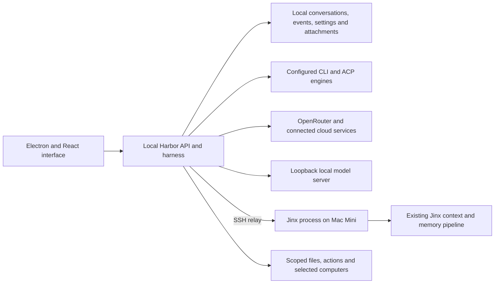

# Agent Harbor architecture

Current implementation and target boundaries, September 7, 2026. Use the
[current handoff](docs/plans/current-handoff.md) for runtime and validation state.

## Current system

The interface uses HTTP commands and one SSE event stream. The loopback harness
owns routing, application tools, approval state, persistence and provider
connections. Provider implementations share contracts, with explicit routing
for differences such as local privacy, Jinx, ordinary OpenRouter actions and
the experimental Local VM path.

| Layer | Location | Responsibility |
|---|---|---|
| Desktop | `electron/` | Service lifecycle, native speech and computer integration |
| Interface | `src/` | Conversations, rooms, settings, attachments, approvals and computer views |
| API and harness | `server/index.ts`, `server/harness/` | Requests, provider registry, routing and events |
| Drivers and contracts | `server/drivers/`, `server/contracts.ts` | CLI/ACP/API streaming and normalized events |
| General actions | `server/action-turn.ts`, `action-tools.ts`, `action-approval.ts`, `action-mcp.ts` | Bounded execution, scoped text tools, approvals and MCP adapters |
| Attachments | `server/attachments.ts`, `attachment-worker.ts`, `attachment-media.ts` | Local originals, parsing, previews, transcription and conversation-scoped reader |
| Jinx bridge | `server/drivers/jinx.ts`, `server/jinx-connection.ts`, `integrations/jinx/` | SSH relay to the existing Mini process, tools and archive receipts |
| Local inference | `server/local-model.ts`, `server/drivers/openrouter.ts` | Loopback endpoint validation, model capabilities and compatible chat transport |
| State and credentials | `server/store.ts`, `config.ts`, `secret-store.ts` | Local records, atomic writes and separate secret storage |

## Execution and authority

Direct OpenRouter, local-model and Jinx turns normally use the general action
loop. It builds a tool set for the current agent and context, checks arguments,
authorizes each call, emits results, and closes owned sessions on completion or
cancellation. The default limits are 80 calls and 20 minutes. Denial stops further
tool execution in that turn. A permitted working directory is not an OS sandbox.

Read and reversible local-write effects run directly during attended tasks.
The scheduled-notes setting permits those effects on unattended tasks. Commands,
connected-app execution and schedule creation require an exact approval or an
existing exact remembered grant. Remembered grants are checked before the
unattended refusal, so they can also authorize matching unattended actions.
Host `desktopAuto` separately permits computer interactions during attended tasks;
it is not a classifier that prevents every consequential click.

Local-only turns omit cloud search, connected apps, commands, computer control
and peer MCP. Cloud-to-local delegation and mixed local/cloud rooms are rejected.
Direct local chat cloud-speech controls are disabled in the UI; group calls and
the generic TTS endpoint lack equivalent per-bot privacy enforcement. The configured loopback server must
itself perform inference locally; Harbor does not audit that server's internals.

API-model rooms receive attachment tools, not the complete direct-conversation
action set. Native CLI/ACP engines retain their own runtime and permission
behavior. Capabilities should be checked for the chosen route rather than
inferred from the presence of a UI button.

The experimental OpenRouter Local VM path remains separate: default-off global
and per-agent switches, exact Terra model and metadata checks, direct turns,
exclusive VM lease, task-scoped routine authority and separate consequential
approvals. It receives no general host/file/app/peer tool set. The heartbeat and
approval calibration exist in the worktree, but the complete VM acceptance and
recovery sequence remains open.

## Attachments and data flow

Uploads are saved under `~/.openmausbot/attachments/<id>/` with private permissions.
User messages contain references. A bounded extracted preview enters context;
`harbor_read_attachment` supplies further text, searches, PDF pages, images,
transcripts or timestamped video frames. The reader requires the reference to
belong to the current conversation and active branch. Native agents additionally
receive working-directory copies under `.harbor-attachments/`.

Document workers have time and heap limits. Speech extraction uses local FFmpeg
and whisper.cpp. Image normalization happens locally. Selected cloud models
receive previews and requested content; local agents use the loopback model.
Visual input is allowed for local models only when the capability endpoint
explicitly reports support. See [attachments](docs/attachments.md) for exact limits.

## Jinx and independent applications

Jinx is currently the Chief of Staff interface in Harbor. An authenticated
loopback bridge inside her existing Mini process is reached by SSH. Her model,
fallback, identity, context assembly, Reach tools and memory pipeline remain
there. Harbor exchanges have separate transcripts and enter Jinx's existing
staging/summarization process. Existing remote archives remain remote.

Jinx can discover teammate metadata and busy/idle status, ask for an available
teammate's reply, or delegate. This does not provide automatic full-transcript
visibility or continuous monitoring. See [Jinx](docs/jinx-connection.md).

Life OS remains separate and unintegrated. The intended ownership boundary is:
Life OS owns commitments and attention; Harbor owns agent execution and its
controls; Jinx Memory owns durable context. Connecting Jinx does not complete
the broader three-application API roadmap.

## Target architecture and remaining gaps

The target domain has eight primitives: Agent, Model, Instruction, Tool, Asset,
Room, Environment and Run. Several exist in today's runtime, but a complete
stable domain schema and versioned replayable run ledger are unfinished.

A formal instruction stack and natural-language policy compiler producing
structured ALLOW/ASK/DENY decisions are future work. They are not current
controls. Likewise, human-only high-risk challenge surfaces, comprehensive
retention/export, bounded cross-application identities, and a tested owner
backup/restore workflow remain roadmap items.

External documents, retrieved memories and other agents' replies are context,
not authorization. Credential handles and minimal context exchange remain design
goals; see [Security](SECURITY.md) for implemented boundaries and limitations,
and [Roadmap](ROADMAP.md) for remaining work.
