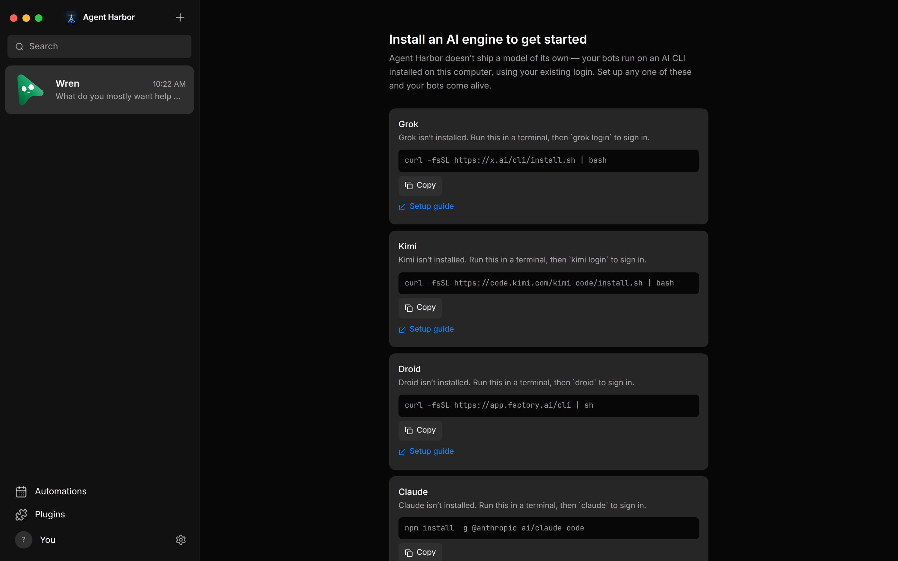

# Agent Harbor

[](https://github.com/LauraFlorey/agent-harbor/actions/workflows/ci.yml)

A local-first **control plane** for a personal team of AI agents: conversations, tasks, rooms, and explicit policy over each agent's computer access.

This project **started as a fork of [OpenMausBot](https://github.com/milind-soni/OpenMausBot)**. It is maintained independently by Laura Florey. OpenMausBot remains a separate product; Agent Harbor is not a drop-in replacement, a Grok Bot clone, or a hosted chat platform.

Agent Harbor has no cryptocurrency or token affiliation.


## Install (run from source)

This is the supported way to try Agent Harbor. There are **no signed installers** yet. You need [Node.js 24+](https://nodejs.org/) and [pnpm 10.33.0](https://pnpm.io/installation), plus Git.

```sh
git clone https://github.com/LauraFlorey/agent-harbor.git
cd agent-harbor
pnpm install --frozen-lockfile
pnpm dev:all
```

That starts the harness, the interface, and the Electron app. Closing the window or Control-C stops the stack.

The desktop app authenticates itself. You can chat with an **OpenRouter API key** (App Settings) without installing a provider CLI. For Claude or Codex, install that CLI and sign in through it. The first run with no engine installed looks like this:



A separate browser tab needs an access code, shown only when you run `pnpm dev:access`. Paste it into the local UI. It lives in tab memory and dies when the server restarts. Do not share it.

Default loopback ports: API `8799`, UI `5199`, webhook ingress `8800`. `OMB_PORT`, `OMB_DATA_DIR`, and `AGENT_HARBOR_DEV_PORT` isolate extra instances. If you start processes separately, set `OMB_UI_ORIGIN` on the server to the exact UI origin (default `http://127.0.0.1:5199`).

Start with computer access and host-folder access **off**. Provider usage can cost money. Step-by-step tester notes: [beta testing guide](docs/beta-testing.md).

## What it is

- A desktop workspace (Electron + a loopback harness) that runs **your** provider CLIs and API keys.
- Per-agent identity, instructions, model selection, and computer destination (off, isolated Local VM, this computer, or a cloud box).
- Approvals, leases, and fail-closed routing in application code — not in the prompt.
- Direct chats, shared rooms, tasks, optional routines and webhooks.

## What it is not

- Not OpenMausBot's messaging-app roadmap (mobile clients, hosted fleet, team marketplace).
- Not a multi-user ChatGPT-style web service (see [LibreChat comparison](docs/comparison-librechat.md) if you need that distinction).
- Not a Discord bot, knowledge base, CRM, or Life OS.
- Not a signed, auto-updating desktop product yet.

Jinx is a Discord working relationship, not part of this application.

## Origin and attribution

Forked from OpenMausBot at the start of this repository. The MIT license and upstream copyright are preserved in [LICENSE](LICENSE). Display names, icons, and docs are Agent Harbor; some on-disk paths stay `~/.openmausbot` and `OMB_*` so existing local data and Keychain items keep working. Details: [rebrand boundary](docs/agent-harbor-rebrand.md).

Harbor last reviewed upstream at OpenMausBot `0.1.21` (2026-08-16). Later OpenMausBot releases are a different product line (Apache-2.0 + `enterprise/`, Android/iOS, hosted workspaces). See [recent upstream notes](docs/upstream-openmausbot-recent.md) if you need that delta; do not treat it as a merge checklist.

## Beta status

**Source on GitHub is public. Trusted installers are not.** Mac test packages are ad-hoc signed and not notarized; Windows test installers are unsigned. Automatic updates are off. You do not need a paid Apple or Microsoft developer account to run from source.

| Capability | Apple Silicon Mac | Windows x64 |
|---|---|---|
| Agents, text chat, model selection, tasks, rooms | Initial beta | Initial beta |
| Microphone dictation | Implemented; live voice acceptance pending | Not supported |
| Direct control and preview of this computer | Explicit permissions; experimental | Not supported |
| Local VM, cloud computers, connected apps, scheduling | Optional; extra setup | Optional; extra setup |

Intel Macs and Windows on ARM are not validated. Unsigned packages may warn or be blocked. Do not turn off system protections to participate. [Apple](https://support.apple.com/102445) · [Microsoft Smart App Control](https://learn.microsoft.com/en-us/windows/apps/develop/smart-app-control/overview).

A merged pull request is not a GitHub Release. There is no versioned installer channel yet.

## Permissions

- Computer access starts **off**. Home-directory start and host-desktop attach are separate opt-ins.
- OpenRouter's Local VM loop is default-off and model-allowlisted. Routine observation is narrow; shell, clicks, typing, and unknown tools need a fresh decision. [OpenRouter](docs/openrouter.md).
- A working directory is not an OS sandbox. Auto mode, connected apps, and provider CLIs can grant real authority.

## Privacy and local data

No analytics SDK. Optional profile stays on disk. Prompts and tool results still go to the provider **you** chose.

Data directory: `~/.openmausbot` (legacy path, on purpose). Secrets: macOS Keychain, or mode `0600` `secrets.json` elsewhere. The API returns `configured` flags, never key values. Session codes are never put in URLs, cookies, or agent environments.

## Development checks

```sh
pnpm lint
pnpm typecheck
pnpm test
pnpm check:electron
pnpm build
pnpm build:server
pnpm check:server-package
pnpm audit --audit-level=moderate
```

CI runs tests and packaging on macOS, Ubuntu, and Windows, plus dependency and history-secret scans. Changes land through pull requests into `main`. See [Contributing](CONTRIBUTING.md).

## Deployment

Source is the supported path while signing is deferred. Package scripts use `--publish never`. A green build is not a signed release. [Deployment](docs/deployment.md) · [release checklist](docs/release-readiness.md).

## Documents

- [Architecture](ARCHITECTURE.md) · [Vision](VISION.md) · [Roadmap](ROADMAP.md)
- [Contributing](CONTRIBUTING.md) · [Security](SECURITY.md)
- [Screenshots](docs/screenshots/README.md) · [Jinx / Discord boundary](docs/plans/jinx-out-of-harbor.md)

## License

[MIT](LICENSE). Copyright of Milind Soni and OpenMausBot contributors is retained for the original work; Agent Harbor changes are copyright Laura Florey and contributors.
