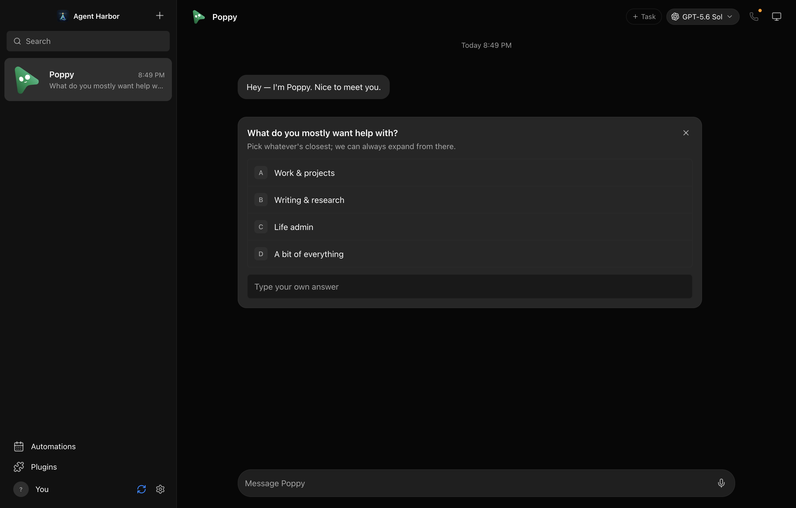

# Agent Harbor

A local workspace for running a team of AI agents, with conversations, tasks, and explicit controls over each agent's computer access.

Agent Harbor is a fork of [OpenMausBot](https://github.com/milind-soni/OpenMausBot), maintained by Laura Florey. It is experimental software being prepared for a friends-and-family beta and public source release. Agent Harbor has no cryptocurrency or token affiliation.



## Beta status and platform limits

**Apple and Microsoft signing enrollment is deferred. No publicly trusted, signed installers are currently offered.** Mac test packages use an ad-hoc development signature and are not Apple-notarized; Windows test installers are unsigned. Automatic updates are disabled. Private package builds have passed build/content checks, but installation on separate tester machines is still pending.

You do **not** need a paid developer or code-signing account to run Agent Harbor from source. The initial testing path is a guided source setup on Apple Silicon Macs and Windows x64 PCs. While the repository is private, testers need repository access; publication will make the source available more broadly. See the [beta testing guide](docs/beta-testing.md) for setup, test steps, and package limitations.

| Capability | Apple Silicon Mac | Windows x64 |
|---|---|---|
| Bots, text chat, model selection, tasks, and rooms | Initial beta scope | Initial beta scope |
| Microphone dictation | Implemented; live voice acceptance pending | Not supported |
| Direct control and preview of this computer | Requires explicit permissions; experimental | Not supported |
| Local VM, cloud computers, connected apps, and scheduling | Optional; setup and feature-specific testing required | Optional; setup and feature-specific testing required |

Intel Macs and Windows on ARM are not validated beta targets. Each tester supplies their own provider account or API key; provider usage may cost money. Start with computer access and host-folder access off. Beta status does not mean every optional feature has been verified end to end.

Unsigned installers may produce an unidentified-publisher warning or be blocked. A README notice does not remove these restrictions. Use the source setup or wait for a supported release if device policy blocks a package; do not disable system-wide protections to participate. See [Apple's app-opening guidance](https://support.apple.com/102445) and [Microsoft's Smart App Control overview](https://learn.microsoft.com/en-us/windows/apps/develop/smart-app-control/overview).

## Run from source

Use Node.js 24 or later and pnpm 10.33.0. Download or clone this repository and open a terminal in its folder before running the commands below. You can use your own OpenRouter API key for text chat without installing a provider CLI. For Claude or Codex, install the corresponding provider CLI and sign in through that tool.

```sh
pnpm install --frozen-lockfile
pnpm dev:all
```

The launcher starts the server, development interface, and Electron desktop app. Closing the app or pressing Control-C stops that stack. The default ports are 8799 for the API, 5199 for the interface, and 8800 for webhook ingress. Keep them on loopback.

The desktop app connects automatically using a private, per-server session credential. A separate browser tab requires an access code, displayed only when the owner explicitly runs:

```sh
pnpm dev:access
```

Paste that code into the local interface. It stays in tab memory and expires when the server restarts. Do not share it. `OMB_PORT`, `OMB_DATA_DIR`, and `AGENT_HARBOR_DEV_PORT` support separate development instances. When starting the processes individually, set `OMB_UI_ORIGIN` on the server to the exact interface origin, including its port; the default is `http://127.0.0.1:5199`.

## Capabilities and permissions

- Run local provider CLIs in separate agent workspaces, with per-agent instructions and model selection.
- Organize direct conversations, shared rooms, and tasks; approve requests in the conversation.
- Explicitly enable a cloud computer, the isolated Local VM, or this computer for each agent. Computer access begins off. Starting in your home directory is a separate opt-in.
- Add supported services through Composio, optional voice through ElevenLabs, and authenticated webhook triggers.

Agents run with the capabilities of their provider CLI and its configured sandbox. A separate working directory does not isolate an OS account. Host access, auto mode, connected services, and provider-wide permission settings can grant substantial authority; choose them deliberately. Protect your backups and use isolated data for testing.

OpenRouter's experimental Local VM loop is default-off globally and per agent and currently restricted to the exact configured model allowlist. An attended observation grant covers only known, no-argument screen/window observation tools. Shell commands, clicks, typing, and unknown operations require a fresh decision. The VM can still reach services you sign into inside it. See [OpenRouter](docs/openrouter.md).

## Privacy and local data

No analytics SDK is included, and the app does not send usage events or onboarding email addresses to an analytics service. The optional profile is stored locally. Your prompts and tool results still go to the provider or connected service you choose. Remote images in messages and service logos can contact their image hosts.

Data lives in `~/.openmausbot` by default. Credentials use macOS Keychain, or a private fallback file on Windows/Linux. The API returns configured flags instead of provider credentials. Session access codes use a private file in the data directory; they are never included in URLs, cookies, automatic startup logs, or agent subprocess environments. The health endpoint is public on loopback; workspace data and event streams require authentication.

The legacy data path and application identifiers remain stable for compatibility. See the [rebrand boundary](docs/agent-harbor-rebrand.md). Source-code visibility does not publish your local data.

## Development checks

```sh
pnpm lint
pnpm typecheck
pnpm test
pnpm check:electron
pnpm build
pnpm build:server
pnpm check:server-package
pnpm audit --audit-level=moderate
```

The server build cleans its output and bundles the external schema validator. Do not commit generated output. CI checks tests and packaging, runs dependency and history-secret scans, and reviews new dependencies on public pull requests. Historical scanner exceptions are restricted to a documented public ingestion key that has been removed from the app.

## Distribution and project documents

Automatic installer updates are disabled until signed release provenance is established. Local packaging commands use `--publish never`. Source testing can proceed while signing is deferred. Any later installer distribution needs an explicitly approved version, signing status, known limitations, and clean-machine results; do not present private unsigned checkpoints as a stable release. See the [release checklist](docs/release-readiness.md).

See [deployment](docs/deployment.md), [contributing](CONTRIBUTING.md), [security reporting](SECURITY.md), [architecture](ARCHITECTURE.md), and [roadmap](ROADMAP.md). Historical screenshots under `docs/screenshots` show earlier upstream interfaces and demonstration conversations; the hero above is the current clean workspace reference.

## License

[MIT](LICENSE). The upstream copyright and contributor attribution are preserved.
